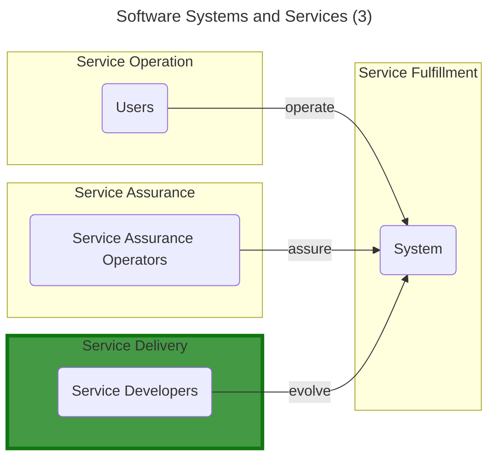

# Software Delivery Positioning

Software is nowadays omnipresent in almost every aspect of our lives. It is used to automate repetitive tasks, to provide a better user experience, to improve the quality of products and services, and to make our lives easier.

Companies relies more and more on software to deliver their products and services. As a result, the software delivery process has become a critical aspect of any organization.

Although very sophisticated architectural discussions may be held, at least the following distinctions are required in order to appropriately separate the software delivery concept:

- **Service Fulfillment** - the system actually fulfilling its purpose.
- **Service Assurance** - the activities that are performed to ensure that the software system is reliable and meets the quality requirements.
- **Service Delivery** - the set up, change, and retirement of a software system or any independently deployable part of the system.

The software delivery process is a series of activities that are performed to ensure that software is delivered towards the fulfilling part of a software system in a timely, efficient, secure, and high-quality manner.

To properly identify the scope of this framework, se need to first separate software delivery domain from other domains, then to specialize its "continuos" aspect, as not all software delivery activities may be qualified as such.

From now on, by "continuous delivery" we will mean "continuous **software** delivery", but for simplicity we will omit the word "software", as everything in this framework is about software.

Here, by "continuous" we mean that a piece of independently deployable software is delivered at least once a day, in a secure and repeatable manner.

By "secure" we mean that the software piece subject to the delivery is fully trusted for immediate deployment, but not necessarily deployed immediately, as deployment may imply further synchronization to different type of needs, such as a business launch event, that may have nothing to do do with the software itself.

As a trusted delivery may be one of many other attempts, we further specialize this concept by stating that there may be multiple intra-day iterations, of which at least one MUST pass all the necessary verifications.
