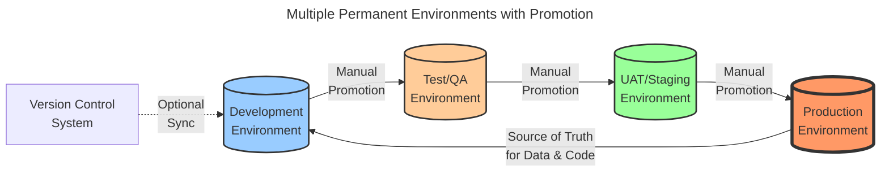
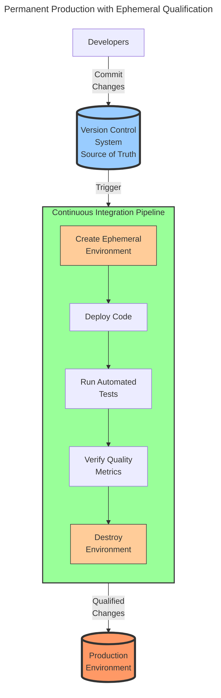

# Software Delivery Strategies

The way software is delivered is one of the primal factors that dictates the performance of an organization. As ["software is eating the world"](https://a16z.com/why-software-is-eating-the-world/), the software delivery process has become a critical aspect of any organization, regardless of their industry or activity sector.

And yet, we are still learning how to manage software in general and the management theory is struggling to keep up with the technological evolution in the domain. We have tried to manage software operations and delivery with techniques borrowed from construction (waterfall methods) or manufacturing (lean methods) but our awareness grows towards the idea that software is an entirely different domain. Software is perfectly malleable, changes in an instant and can be replicated as much as we want in the blink of an eye. It is not a "material" as we are accustomed to think by the mainstream management and accounting theory patterns.

Many obsolete patterns are still in use today, as these theoretical patterns are still in the minds and practices of many organizations. Unfortunately, this is more the rule than the exception. This article identifies some of these patterns and provides a set of strategies that can be used to evolve or achieve valuable outcomes within systems that are still constrained by obsolete software delivery practices.

## Where and who?

Software delivery is practically everywhere today. The absolute minimalistic user must still be able at least to activate and set up a smart phone; download and operate at least an application of interest such as Gmail, Uber or a banking application.

The software user benefits from all the features of the software, but they are shielded from the complexity of the software creation, maintenance and delivery process. Ideally, the user only knows the current form and state of the software applications and sometimes must endure some updates or device change. 

The complexity of software delivery falls on the shoulders of the software developers, individuals or organizations. However, organizations are more and more pulled into the software delivery domain even if their domain is entirely different. They must learn fundamental software delivery techniques and are aware that changes should be "trusted" before their propagation.

Delegation of software delivery responsibilities to some specialized supplier is a common practice, however even if this type of arrangement simplifies operation, it never eliminates all organizational specific responsibility in the area.

## Practices

This chapter tries to establish a logical and somewhat maturity progression of the software delivery practices.

### Single Environment

This is the simplest strategy and is typical for end users and early-stage startups. For example, a person in need of a taxi may quickly install Uber, register, and simply call for a cab. The environment where the application runs is the user's device. The focus is on service fulfillment, and the service delivery is limited to the actions of download, installation, and user registration.

In general, this is how startups also begin: use software more or less directly in production without intermediate verification stages.

Key characteristics:
- **Single Source of Truth**: The production environment is the only environment
- **Direct Usage**: No intermediate testing or staging environments
- **Minimal Complexity**: Suitable for simple use cases or early development
- **High Risk**: Changes go directly to production without verification
- **User-Centric**: Focus is entirely on service fulfillment

This strategy works well for:
- End-user applications with automatic updates
- Proof-of-concept projects
- Very early-stage startups with minimal code complexity
- Personal projects or tools

### Multiple Permanent Environments with Promotion

Once a person or organization begins to deal with custom code, for example a fairly important Excel macro, they realize that changes to the code must be "trusted" before their propagation.
This "trust" is obtained by verifying the code in a different environment before accepting it for use in production.

Traditionally, organizations have somehow implicitly accepted the fact these verification environments have permanent expressions. Although not strictly necessary, traditional "business software machines" were expensive, difficult to acquire and set up, therefore these initial activities were performed exceptionally. These properties also forced roles specializations.

Production is the source of truth for both data and code aspects. Whenever a change is required, the developers must ensure they start from a production snapshot of the code.

Version control systems may be helpful but not required.

Environments have different administrators and responsibilities. Software deliverables are "thrown" over the fence with some formal release procedure. We clearly observe the distinction between "OPS" and "DEV" roles and interests.

Software delivery encounters a significant amount of friction. Business users are called to execute "regression" and "acceptance" tests in some dedicated verification environment, usually bearing the name of "UAT - User Acceptance Testing", "Staging", or "Pre-Production".

Key characteristics:
- **Production as Source of Truth**: Code and data originate from production
- **Manual Promotion**: Changes are manually promoted through environments
- **Permanent Infrastructure**: All environments exist continuously
- **Role Separation**: Clear distinction between DEV and OPS teams
- **High Friction**: Significant coordination and waiting time between stages
- **Resource Intensive**: Multiple permanent environments require ongoing maintenance

This strategy is common in:
- Traditional enterprise organizations
- Regulated industries with strict change control
- Legacy systems with complex dependencies
- Organizations transitioning from waterfall methodologies

### Permanent Production with Ephemeral Qualification

This strategy represents a significant evolution in software delivery practices, enabled by modern cloud infrastructure and containerization technologies. Instead of maintaining multiple permanent environments, organizations create temporary (ephemeral) environments on-demand for testing and qualification purposes.

The key insight is that verification environments don't need to persist between deployments. They can be created fresh for each change, run the necessary tests, and then be destroyed. This approach offers several advantages:

- **Consistency**: Each test runs in a clean, identical environment
- **Cost Efficiency**: Resources are only consumed during active testing
- **Scalability**: Multiple parallel test environments can be created simultaneously
- **Speed**: Automated creation and destruction eliminates manual setup time

In this model, the version control system becomes the single source of truth for code. Developers commit changes to version control, which triggers an automated Continuous Integration (CI) pipeline. This pipeline:

1. Creates a fresh ephemeral environment
2. Deploys the code changes
3. Runs automated tests (unit, integration, end-to-end)
4. Collects quality metrics and test results
5. Destroys the environment

Only changes that pass all automated verifications are considered qualified for production deployment. Production remains the only permanent environment, while all qualification happens in temporary, disposable environments.

This strategy enables true Continuous Integration and Continuous Delivery (CI/CD), where code changes can be verified and deployed multiple times per day with high confidence and minimal manual intervention.

Key characteristics of this strategy:

- **Version Control as Source of Truth**: All code changes are tracked and managed through version control
- **Automation First**: Manual interventions are minimized or eliminated
- **Fast Feedback**: Developers receive immediate feedback on their changes
- **DevOps Culture**: Development and operations responsibilities converge
- **Infrastructure as Code**: Environments are defined and created programmatically
- **Reduced Friction**: No waiting for environment availability or manual promotion processes

This strategy is ideal for:
- Modern cloud-native applications
- Organizations practicing DevOps and Agile methodologies
- Microservices architectures
- Teams with strong automation capabilities
- Projects requiring frequent deployments

## Strategy Comparison and Evolution

The three strategies represent an evolutionary path in software delivery maturity:

| Aspect | Single Environment | Multiple Permanent Environments | Ephemeral Qualification |
|--------|-------------------|--------------------------------|------------------------|
| **Source of Truth** | Production only | Production (code & data) | Version Control (code) |
| **Verification** | None | Manual testing in permanent envs | Automated testing in ephemeral envs |
| **Deployment Frequency** | Continuous (automatic) | Weekly to monthly | Multiple times per day |
| **Infrastructure Cost** | Minimal | High (multiple permanent envs) | Variable (pay-per-use) |
| **Automation Level** | High (for users) | Low to medium | High |
| **Risk Level** | High | Medium | Low |
| **Feedback Speed** | Immediate (for users) | Slow (days to weeks) | Fast (minutes to hours) |
| **Team Structure** | Unified or single person | Separated (DEV/OPS) | Integrated (DevOps) |

## Conclusion

Understanding these software delivery strategies is crucial for organizations seeking to improve their software delivery performance. While the Single Environment strategy may suffice for simple use cases, most organizations will find themselves operating with Multiple Permanent Environments due to historical practices and organizational inertia.

The evolution toward Permanent Production with Ephemeral Qualification represents the modern best practice, enabled by cloud infrastructure, containerization, and automation tools. This strategy aligns with the principles of Continuous Integration and Continuous Delivery, enabling organizations to deliver software faster, with higher quality, and lower risk.

However, the transition between strategies is not trivial. It requires:
- Cultural change toward DevOps practices
- Investment in automation and tooling
- Development of new skills and capabilities
- Organizational restructuring to break down silos
- Adoption of Infrastructure as Code practices

Organizations should assess their current strategy, understand the benefits and challenges of each approach, and plan a deliberate evolution path that aligns with their business objectives and technical capabilities. The goal is not necessarily to reach the most advanced strategy immediately, but to continuously improve software delivery performance in a sustainable manner.