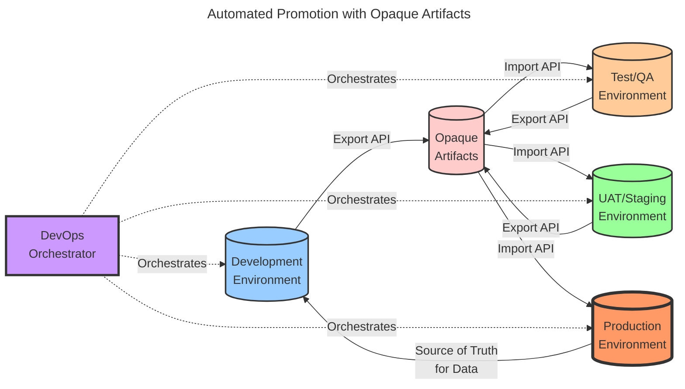
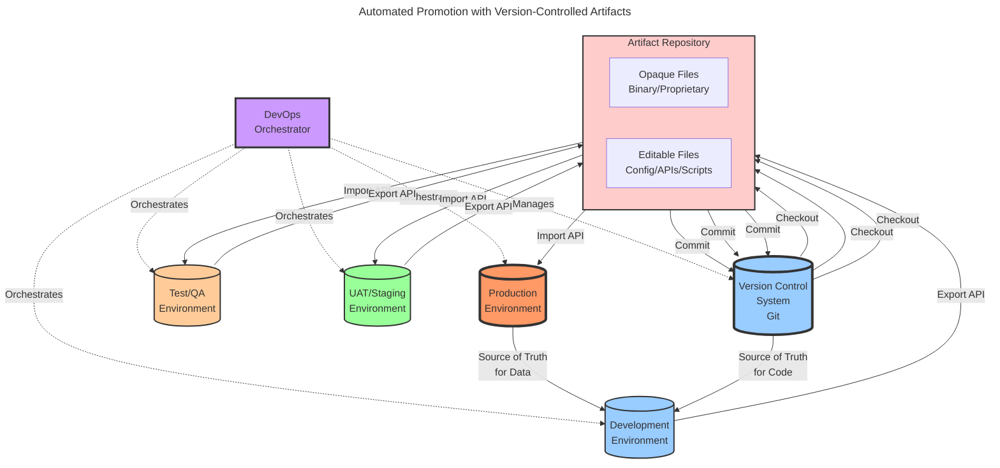

# Software Delivery Strategies

## TL;DR

**Continuous Delivery is the proven ideal**: Research consistently shows that organizations practicing continuous delivery with ephemeral qualification environments achieve 200x faster deployments, 24x faster recovery, and significantly better business outcomes than traditional approaches.

**Multiple permanent environments remain the dominant reality**: Despite the evidence, most organizations still operate with manual promotion through DEV/TEST/UAT/PROD environments due to historical practices, organizational inertia, and legacy infrastructure investments.

**Hybrid strategies emerge from real constraints**: Many organizations adopt incomplete intermediate approaches—such as automated promotion with opaque artifacts or partial version control—not by choice, but due to constraints imposed by legacy platforms, proprietary systems, regulatory requirements, and organizational resistance to change.

**The path forward requires acknowledgment of reality**: While continuous delivery should be the target, organizations must navigate their current constraints pragmatically. This article presents both the ideal fundamental strategies and the hybrid approaches that serve as transitional steps when working within technological and organizational limitations.

- https://dora.dev/research/2024/dora-report/
- https://dora.dev/research/2025/dora-report/
- https://www.amazon.com/DevOps-Handbook-World-Class-Reliability-Organizations/dp/1942788002

**Note**: This article has been written with assistance from [Bob](https://www.ibm.com/products/bob).

---

**Table of Contents**
- [Software Delivery Strategies](#software-delivery-strategies)
  - [TL;DR](#tldr)
  - [Context](#context)
  - [Where and who?](#where-and-who)
  - [Fundamental Delivery Strategies](#fundamental-delivery-strategies)
    - [Single Environment](#single-environment)
    - [Multiple Permanent Environments with Promotion](#multiple-permanent-environments-with-promotion)
    - [Permanent Production with Ephemeral Qualification](#permanent-production-with-ephemeral-qualification)
    - [Fundamental Strategies Comparison](#fundamental-strategies-comparison)
    - [Recommendation: Adopt Continuous Delivery](#recommendation-adopt-continuous-delivery)
  - [Working Within Constraints: Hybrid Strategies](#working-within-constraints-hybrid-strategies)
    - [Automated Promotion with Opaque Artifacts](#automated-promotion-with-opaque-artifacts)
      - [Comparison with Fundamental Strategies](#comparison-with-fundamental-strategies)
    - [Automated Promotion with Version-Controlled Artifacts](#automated-promotion-with-version-controlled-artifacts)
      - [Comparison with Fundamental Strategies](#comparison-with-fundamental-strategies-1)
  - [Conclusion](#conclusion)
    - [Key Takeaways](#key-takeaways)

---

## Context

The way software is delivered is one of the primal factors that dictates the performance of an organization. As ["software is eating the world"](https://a16z.com/why-software-is-eating-the-world/), the software delivery process has become a critical aspect of any organization, regardless of their industry or activity sector.

And yet, we are still learning how to manage software in general and the management theory is struggling to keep up with the technological evolution in the domain. We have tried to manage software operations and delivery with techniques borrowed from construction (waterfall methods) or manufacturing (lean methods) but our awareness grows towards the idea that software is an entirely different domain. Software is perfectly malleable, changes in an instant and can be replicated as much as we want in the blink of an eye. It is not a "material" as we are accustomed to think by the mainstream management and accounting theory patterns.

Many obsolete patterns are still in use today, as these theoretical patterns are still in the minds and practices of many organizations. Unfortunately, this is more the rule than the exception. This article identifies some of these patterns and provides a set of strategies that can be used to evolve or achieve valuable outcomes within systems that are still constrained by obsolete software delivery practices.

## Where and who?

Software delivery is practically everywhere today. The absolute minimalistic user must still be able at least to activate and set up a smart phone; download and operate at least an application of interest such as Gmail, Uber or a banking application.

The software user benefits from all the features of the software, but they are shielded from the complexity of the software creation, maintenance and delivery process. Ideally, the user only knows the current form and state of the software applications and sometimes must endure some updates or device change. 

The complexity of software delivery falls on the shoulders of the software developers, individuals or organizations. However, organizations are more and more pulled into the software delivery domain even if their domain is entirely different. They must learn fundamental software delivery techniques and are aware that changes should be "trusted" before their propagation.

Delegation of software delivery responsibilities to some specialized supplier is a common practice, however even if this type of arrangement simplifies operation, it never eliminates all organizational specific responsibility in the area. There is always a big stack of vendors and software suppliers, the ["full stack is really deep"](https://www.infoq.com/presentations/six-impossible-things/), but the most successful organizations accept full responsibility over the delivery of the software that fulfills their business, pay attention and adopt the most effective delivery strategies.

The strategies presented in this article apply across this spectrum—from individual developers to large enterprises, from simple applications to complex distributed systems. Understanding these strategies helps organizations make informed decisions about their software delivery approach based on their specific context and constraints.

## Fundamental Delivery Strategies

This section establishes the fundamental software delivery strategies that represent the primary options available to organizations. These three strategies form the foundation for understanding software delivery maturity and evolution.

### Single Environment

This is the simplest strategy and is typical for end users and early-stage startups. For example, a person in need of a taxi may quickly install Uber, register, and simply call for a cab. The environment where the application runs is the user's device. The focus is on service fulfillment, and the service delivery is limited to the actions of download, installation, and user registration.

In general, this is how startups also begin: use software more or less directly in production without intermediate verification stages.

Key characteristics:
- **Single Source of Truth**: The production environment is the only environment
- **Direct Usage**: No intermediate testing or staging environments
- **Minimal Complexity**: Suitable for simple use cases or early development
- **High Risk**: Changes go directly to production without verification
- **User-Centric**: Focus is entirely on service fulfillment

This strategy works well for:
- End-user applications with automatic updates
- Proof-of-concept projects
- Very early-stage startups with minimal code complexity
- Personal projects or tools

### Multiple Permanent Environments with Promotion

Once a person or organization begins to deal with custom code, for example a fairly important Excel macro, they realize that changes to the code must be "trusted" before their propagation.
This "trust" is obtained by verifying the code in a different environment before accepting it for use in production.

Traditionally, organizations have somehow implicitly accepted the fact these verification environments have permanent expressions. Although not strictly necessary, traditional "business software machines" were expensive, difficult to acquire and set up, therefore these initial activities were performed exceptionally. These properties also forced roles specializations.

Production is the source of truth for both data and code aspects. Whenever a change is required, the developers must ensure they start from a production snapshot of the code.

Version control systems may be helpful but not required.

Environments have different administrators and responsibilities. Software deliverables are "thrown" over the fence with some formal release procedure. We clearly observe the distinction between "OPS" and "DEV" roles and interests.

Software delivery encounters a significant amount of friction. Business users are called to execute "regression" and "acceptance" tests in some dedicated verification environment, usually bearing the name of "UAT - User Acceptance Testing", "Staging", or "Pre-Production".

Key characteristics:
- **Production as Source of Truth**: Code and data originate from production
- **Manual Promotion**: Changes are manually promoted through environments
- **Permanent Infrastructure**: All environments exist continuously
- **Role Separation**: Clear distinction between DEV and OPS teams
- **High Friction**: Significant coordination and waiting time between stages
- **Resource Intensive**: Multiple permanent environments require ongoing maintenance

This strategy is common in:
- Traditional enterprise organizations
- Regulated industries with strict change control
- Legacy systems with complex dependencies
- Organizations transitioning from waterfall methodologies

### Permanent Production with Ephemeral Qualification

This strategy represents a significant evolution in software delivery practices, enabled by modern cloud infrastructure and containerization technologies. Instead of maintaining multiple permanent environments, organizations create temporary (ephemeral) environments on-demand for testing and qualification purposes.

The key insight is that verification environments don't need to persist between deployments. They can be created fresh for each change, run the necessary tests, and then be destroyed. This approach offers several advantages:

- **Consistency**: Each test runs in a clean, identical environment
- **Cost Efficiency**: Resources are only consumed during active testing
- **Scalability**: Multiple parallel test environments can be created simultaneously
- **Speed**: Automated creation and destruction eliminates manual setup time

In this model, the version control system becomes the single source of truth for code. Developers commit changes to version control, which triggers an automated Continuous Integration (CI) pipeline. This pipeline:

1. Creates a fresh ephemeral environment
2. Deploys the code changes
3. Runs automated tests (unit, integration, end-to-end)
4. Collects quality metrics and test results
5. Destroys the environment

Only changes that pass all automated verifications are considered qualified for production deployment. Production remains the only permanent environment, while all qualification happens in temporary, disposable environments.

This strategy enables true Continuous Integration and Continuous Delivery (CI/CD), where code changes can be verified and deployed multiple times per day with high confidence and minimal manual intervention.

Key characteristics of this strategy:

- **Version Control as Source of Truth**: All code changes are tracked and managed through version control
- **Automation First**: Manual interventions are minimized or eliminated
- **Fast Feedback**: Developers receive immediate feedback on their changes
- **DevOps Culture**: Development and operations responsibilities converge
- **Infrastructure as Code**: Environments are defined and created programmatically
- **Reduced Friction**: No waiting for environment availability or manual promotion processes

This strategy is ideal for:
- Modern cloud-native applications
- Organizations practicing DevOps and Agile methodologies
- Microservices architectures
- Teams with strong automation capabilities
- Projects requiring frequent deployments

### Fundamental Strategies Comparison

The three fundamental strategies represent distinct approaches to software delivery:

| Aspect | Single Environment | Multiple Permanent Environments | Ephemeral Qualification |
|--------|-------------------|--------------------------------|------------------------|
| **Source of Truth** | Production only | Production (code & data) | Version Control (code) |
| **Verification** | None | Manual testing in permanent envs | Automated testing in ephemeral envs |
| **Deployment Frequency** | Continuous (automatic) | Weekly to monthly | Multiple times per day |
| **Infrastructure Cost** | Minimal | High (multiple permanent envs) | Variable (pay-per-use) |
| **Automation Level** | High (for users) | Low | High |
| **Risk Level** | High | Medium | Low |
| **Feedback Speed** | Immediate (for users) | Slow (days to weeks) | Fast (minutes to hours) |
| **Team Structure** | Unified or single person | Separated (DEV/OPS) | Integrated (DevOps) |

### Recommendation: Adopt Continuous Delivery

Based on extensive research and industry evidence, **organizations should strive toward the Ephemeral Qualification strategy** (Continuous Delivery/Continuous Deployment) as their target state. This recommendation is strongly supported by empirical data:

**Evidence from State of DevOps Research:**

The annual [State of DevOps Report](https://dora.dev/research/) by DORA (DevOps Research and Assessment) consistently demonstrates that elite performers using continuous delivery practices achieve:

- **Deployment Frequency**: On-demand deployments (multiple times per day) vs. once per week to once per month for low performers
- **Lead Time for Changes**: Less than one hour vs. one to six months for low performers
- **Time to Restore Service**: Less than one hour vs. one week to one month for low performers
- **Change Failure Rate**: 0-15% vs. 46-60% for low performers

**Key Benefits from "The DevOps Handbook":**

As documented in ["The DevOps Handbook"](https://itrevolution.com/product/the-devops-handbook/) by Gene Kim, Jez Humble, Patrick Debois, and John Willis, continuous delivery practices enable:

1. **Faster Time to Market**: Reduce lead times from months to hours or days
2. **Higher Quality**: Automated testing catches defects earlier when they're cheaper to fix
3. **Lower Risk**: Small, frequent changes are easier to troubleshoot and roll back
4. **Improved Stability**: Paradoxically, deploying more frequently leads to more stable systems
5. **Better Employee Satisfaction**: Reduced manual toil and firefighting improves morale
6. **Competitive Advantage**: Faster feedback loops enable rapid experimentation and learning

**Business Impact:**

Organizations that adopt continuous delivery practices report:
- 200x faster deployment frequency
- 24x faster recovery from failures
- 3x lower change failure rates
- 2x more likely to exceed profitability, market share, and productivity goals

**The Path Forward:**

While the Single Environment strategy may suffice for simple use cases, and Multiple Permanent Environments remains common due to historical practices, the evidence overwhelmingly supports evolution toward Ephemeral Qualification with continuous delivery practices.

The transition requires investment in:
- Automated testing infrastructure
- CI/CD pipeline tooling
- Infrastructure as Code capabilities
- Cultural transformation toward DevOps practices
- Skills development in automation and cloud technologies

However, the return on this investment is substantial and measurable across all key performance indicators: speed, stability, quality, and business outcomes.

## Working Within Constraints: Hybrid Strategies

### Automated Promotion with Opaque Artifacts

This hybrid strategy represents an evolutionary step from manual promotion toward automation, while maintaining the traditional multiple permanent environments structure. Organizations adopt this approach when they need to improve delivery speed but are constrained by systems that don't expose their internal code structure in a human-readable format.

In this model, a DevOps orchestrator automates the promotion process by calling export-import APIs provided by the software platform. The exported artifacts are opaque binary or proprietary format files that cannot be easily inspected or modified outside the platform. These artifacts are promoted through the environment chain (DEV → TEST → UAT → PROD) automatically, reducing manual intervention and human error.

Key characteristics:
- **Automated Promotion**: DevOps orchestrator handles environment-to-environment transfers
- **Opaque Artifacts**: Export files are in proprietary or binary formats
- **API-Driven**: Uses platform-specific export-import APIs
- **Permanent Environments**: All environments remain continuously available
- **Reduced Manual Effort**: Automation eliminates manual file transfers and deployments
- **Limited Visibility**: Artifacts cannot be easily inspected or modified outside the platform
- **Platform Dependency**: Tied to specific platform capabilities and APIs

This strategy is common in:
- Organizations using low-code/no-code platforms
- Enterprise systems with proprietary deployment mechanisms (SAP, Oracle, Salesforce)
- Legacy platforms being modernized incrementally
- Regulated environments requiring audit trails but allowing automation

Advantages over manual promotion:
- Faster and more reliable promotions
- Reduced human error in deployment process
- Consistent promotion procedures
- Audit trail of all promotions
- Ability to schedule promotions

Limitations:
- Artifacts remain opaque and difficult to inspect
- Limited ability to perform code reviews on artifacts
- Dependency on platform-specific APIs
- Difficult to track changes at a granular level
- Still requires permanent infrastructure for all environments

#### Comparison with Fundamental Strategies

| Aspect | Multiple Permanent Environments | Automated Promotion (Opaque) | Ephemeral Qualification |
|--------|--------------------------------|------------------------------|------------------------|
| **Promotion Process** | Manual | Automated via orchestrator | Automated via CI/CD |
| **Artifact Visibility** | Full (direct access) | Opaque (binary/proprietary) | Full (source code) |
| **Version Control** | Optional | No | Yes (required) |
| **Deployment Speed** | Slow (manual steps) | Medium (automated but sequential) | Fast (parallel, on-demand) |
| **Infrastructure Cost** | High (permanent envs) | High (permanent envs) | Variable (ephemeral) |
| **Code Review** | Possible | Not possible | Full |
| **Rollback** | Manual, complex | Automated, limited | Automated via VCS |
| **Human Error Risk** | High | Low | Very Low |

**Evolution Path**: This strategy represents an improvement over manual promotion by introducing automation, but still falls short of continuous delivery practices. Organizations should view this as a transitional step toward ephemeral qualification.

### Automated Promotion with Version-Controlled Artifacts

This strategy builds upon the previous one by adding version control to the promotion process. While the artifacts may still be partially opaque (binary or proprietary formats), the organization commits them to a version control system like Git alongside human-readable configuration files and API definitions.

This hybrid approach bridges traditional deployment practices with modern DevOps principles. The version control system tracks both the opaque artifacts and any editable configuration or API files, providing a historical record of changes and enabling some level of code review and collaboration.

Key characteristics:
- **Version Control Integration**: All artifacts committed to Git or similar VCS
- **Hybrid Artifact Types**: Mix of opaque (binary) and editable (text) files
- **Change Tracking**: Full history of all changes with commit messages
- **Automated Promotion**: Orchestrator manages export-import-commit cycle
- **Partial Code Review**: Editable files can be reviewed; opaque files tracked but not inspected
- **Branching Strategy**: Can use Git branches for different environments or features
- **Rollback Capability**: Easy rollback to previous versions via Git history

This strategy is ideal for:
- Organizations modernizing legacy platforms incrementally
- Platforms with mixed artifact types (some editable, some binary)
- Teams wanting version control benefits without full source code access
- Regulated industries requiring change tracking and audit trails
- Integration platforms (MuleSoft, webMethods, IBM Integration Bus) with XML/JSON configs and compiled artifacts

Advantages over opaque-only artifacts:
- Version history and change tracking
- Ability to review and collaborate on editable portions
- Branching and merging capabilities for parallel development
- Easy rollback to previous versions
- Better compliance and audit capabilities
- Foundation for future migration to full source control

Limitations:
- Opaque artifacts still difficult to review and merge
- Git may not handle large binary files efficiently (requires Git LFS)
- Merge conflicts in binary files cannot be resolved automatically
- Still requires permanent infrastructure
- Complexity of managing mixed artifact types

Configuration management examples:
- **Editable**: API definitions (OpenAPI/Swagger), configuration files (YAML/JSON), deployment scripts, environment variables
- **Opaque**: Compiled integration flows, proprietary package formats, encrypted credentials, platform-specific binaries

#### Comparison with Fundamental Strategies

| Aspect | Multiple Permanent Environments | Automated Promotion (Version-Controlled) | Ephemeral Qualification |
|--------|--------------------------------|------------------------------------------|------------------------|
| **Promotion Process** | Manual | Automated via orchestrator | Automated via CI/CD |
| **Artifact Visibility** | Full (direct access) | Partial (mixed opaque/editable) | Full (source code) |
| **Version Control** | Optional | Yes (Git/VCS) | Yes (required) |
| **Change Tracking** | Limited | Full history via VCS | Full history via VCS |
| **Code Review** | Possible | Partial (editable files only) | Full |
| **Deployment Speed** | Slow (manual steps) | Medium (automated but sequential) | Fast (parallel, on-demand) |
| **Infrastructure Cost** | High (permanent envs) | High (permanent envs + VCS) | Variable (ephemeral) |
| **Rollback** | Manual, complex | Automated via VCS | Automated via VCS |
| **Merge Conflicts** | N/A | Difficult (binary files) | Manageable (text files) |
| **Branching Strategy** | N/A | Possible but limited | Full Git workflow |

**Evolution Path**: This strategy represents a significant improvement by introducing version control and partial transparency. It serves as a better transitional step than opaque-only artifacts, providing a foundation for eventual migration to full continuous delivery practices. Organizations should continue evolving toward ephemeral qualification as platform capabilities improve.

While the fundamental strategies represent the ideal options, many organizations face constraints that prevent immediate adoption of continuous delivery practices. These constraints may include:

- Legacy platforms with proprietary deployment mechanisms
- Regulatory requirements for specific approval processes
- Limited access to source code (vendor-provided systems)
- Organizational resistance to change
- Technical debt in existing systems

This section presents hybrid strategies that organizations can adopt as intermediate steps or pragmatic solutions when working within such constraints. **These strategies are not recommended as end goals**, but rather as practical approaches to improve delivery practices while navigating real-world limitations.

Each hybrid strategy is compared against the fundamental options to help you understand the trade-offs and plan your evolution path.

## Conclusion

This article has presented a comprehensive framework for understanding software delivery strategies, organized into two categories:

**Fundamental Strategies:**
1. Single Environment - Simple, direct usage
2. Multiple Permanent Environments with Promotion - Traditional enterprise approach
3. Permanent Production with Ephemeral Qualification - Modern continuous delivery

**Hybrid Strategies (Working Within Constraints):**
1. Automated Promotion with Opaque Artifacts - Automation without code visibility
2. Automated Promotion with Version-Controlled Artifacts - Partial transparency with VCS

These latter hybrid strategies are examples, the reality of each organization may imply different combinations and tradeoffs.

### Key Takeaways

**For Organizations Starting Their Journey:**
- Understand where you are today in the maturity spectrum
- Recognize that Multiple Permanent Environments, while common, is not the end goal
- The evidence strongly supports evolution toward Continuous Delivery practices

**For Organizations Facing Constraints:**
- Hybrid strategies provide pragmatic intermediate steps
- Automation improvements are valuable even without full continuous delivery
- Version control adoption is a critical milestone, even for opaque artifacts
- These strategies should be viewed as transitional, not permanent solutions

**For All Organizations:**
- The business case for Continuous Delivery is compelling and evidence-based
- Elite performers achieve 200x faster deployments with higher stability
- The transition requires investment but delivers measurable ROI
- Cultural transformation is as important as technical implementation

However, the transition between strategies is not trivial. It requires:
- Cultural change toward DevOps practices
- Investment in automation and tooling
- Development of new skills and capabilities
- Organizational restructuring to break down silos
- Adoption of Infrastructure as Code practices

Organizations should assess their current strategy, understand the benefits and challenges of each approach, and plan a deliberate evolution path that aligns with their business objectives and technical capabilities. The goal is not necessarily to reach the most advanced strategy immediately, but to continuously improve software delivery performance in a sustainable manner.
